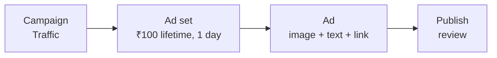

# Run a ₹100 Test Ad on Meta

Sep 25, 2026 · @ZimDev

## Why run this ad

One campaign with a ₹100 lifetime budget, running for 1 day, gives the ad account real campaigns and spend for Adwise to sync. Right now Adwise syncs ad account 801117970548734 correctly, but that account has no campaigns, so there's nothing to show.

When you're done you'll have 1 campaign, 1 ad set and 1 ad. That's enough for campaign, ad and daily metric rows to show up in Adwise within about an hour of the ad starting.

## Before you start

You need a Facebook Page, a payment method on the ad account, and to be using the same ad account Adwise is connected to.

- [ ] **Facebook Page.** Every Meta ad runs from a Page. If you don't have one, create a basic Page at facebook.com/pages/create first.
- [ ] **Right ad account.** In Ads Manager (adsmanager.facebook.com), the account switcher at top left should show account ID 801117970548734. Adwise can only see accounts you approved when you connected it.
- [ ] **Payment method.** Go to Billing & payments → Payment settings and add a UPI ID, card or prepaid funds. The account currency is INR, so the budget below is in rupees.
- [ ] **Creative ready.** One square image (1080 × 1080 px) or an existing Page post, plus a headline and one line of text.
- [ ] **Adwise running.** `make api`, `make worker` and `make web` are all running (see the README).

## Create the ad in Ads Manager

Create 1 Traffic campaign with a ₹100 lifetime budget and a 1-day schedule. It takes about 10 minutes.

Each level sits inside the one before it. Adwise syncs all three.

1. **Open Ads Manager.** Go to adsmanager.facebook.com, check that the account is 801117970548734, and click **+ Create**.
2. **Campaign.**
   - Objective: **Traffic**. It's cheap and easy to set up, and it gives you clicks and CTR to look at.
   - Setup: choose **Manual** (not Advantage+) if asked, so you can set the budget exactly.
   - Name: `Adwise test – ₹100`.
   - Turn **Advantage campaign budget** off, so the budget lives on the ad set.
3. **Ad set.**
   - Conversion location: **Website**. Use any page you own, or your Facebook Page URL.
   - Budget: **Lifetime budget**, **₹100**.
   - Schedule: start today, **end tomorrow at the same time** (1 day).
   - Audience: Location **India**, age 18–65+, no interests. A broad audience delivers fastest.
   - Placements: **Advantage+ placements** (the default).
4. **Ad.**
   - Identity: pick your Facebook Page (and Instagram account if linked).
   - Format: **Single image**. Upload your 1080 × 1080 image, or choose **Use existing post**.
   - Primary text: 1 line. Headline: up to 40 characters.
   - Destination URL: the same website as the ad set. Call to action: **Learn more**.
5. **Publish.** Click **Publish**. The ad shows **In review**, usually for under 24 hours, then **Active**.

## Keep spend at ₹100

A lifetime budget with an end date is the main cap. An account spending limit is a hard backstop.

| Control | Where | Set to |
| --- | --- | --- |
| Lifetime budget | Ad set → Budget & schedule | ₹100 |
| End date | Ad set → Budget & schedule | 1 day after start |
| Account spending limit | Billing & payments → Payment settings → Account spending limit | ₹150 (₹100 plus headroom for tax and rounding) |

Meta can go slightly over the budget on a single day, but never over a lifetime budget. GST (18%) is added to what you pay, so ₹100 of ads costs about ₹118. Delete or remove the spending limit afterwards if you plan to run real campaigns.

## See it in Adwise

Once the ad is published, click **Sync now** in Adwise. The campaign shows up right away, and metrics appear once the ad has delivered impressions.

1. Make sure `make worker` is running. It does every sync, and also re-syncs all accounts hourly.
2. In Adwise, open **Integrations** and click **Sync now** on the Meta card.
3. The campaign, ad set and ad appear after the first sync, even while the ad is still in review.
4. Spend, impressions and clicks appear after the ad goes **Active** and delivers. Meta's numbers lag by up to a few hours. Each sync re-pulls the last 3 days, so later corrections come through automatically.

| When | What you'll see in Adwise |
| --- | --- |
| Right after publishing + Sync now | Campaign, ad set and ad listed, no metrics |
| A few hours after going Active | First impressions, clicks and spend |
| Day after the end date | Final totals, about ₹100 spend |

## Troubleshooting

| Problem | Fix |
| --- | --- |
| "Budget too low" when setting ₹100 | Meta has a per-day minimum. Keep the schedule at 1 day, or raise the budget to the minimum Ads Manager shows. |
| Ad rejected | Open the ad, read the reason, edit the text or image (e.g. remove before/after claims, too much text in the image), and republish. |
| Payment failed, ad not delivering | Fix the payment method under Billing & payments. Delivery resumes on its own. |
| Ad stuck "In review" after 24 hours | Edit and republish once. Review usually restarts and clears within hours. |
| Campaign in Ads Manager but not in Adwise | Check `make worker` is running, then click **Sync now**. If it's still missing, the campaign is in a different ad account: disconnect Meta in Adwise, reconnect, and select that account on Meta's consent screen. |
| Integration shows "needs reauth" | Meta's token expired or was revoked. Click reconnect on the Meta card. |
